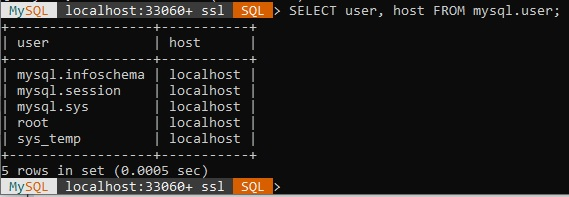
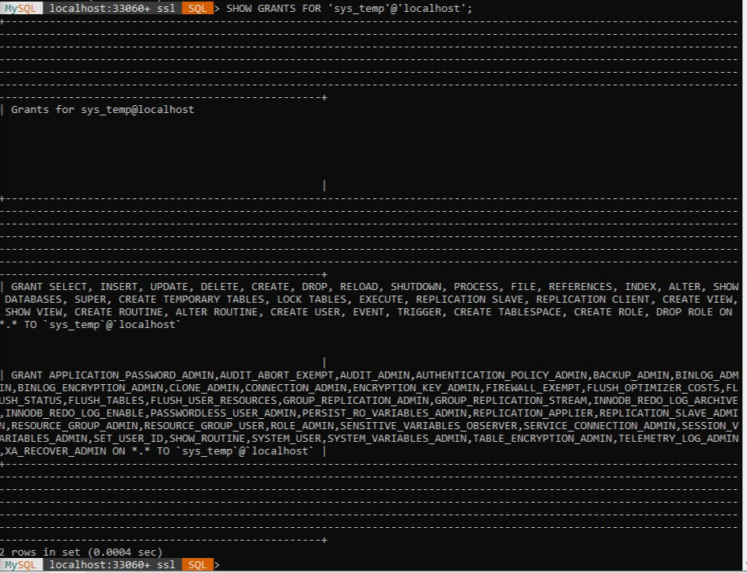
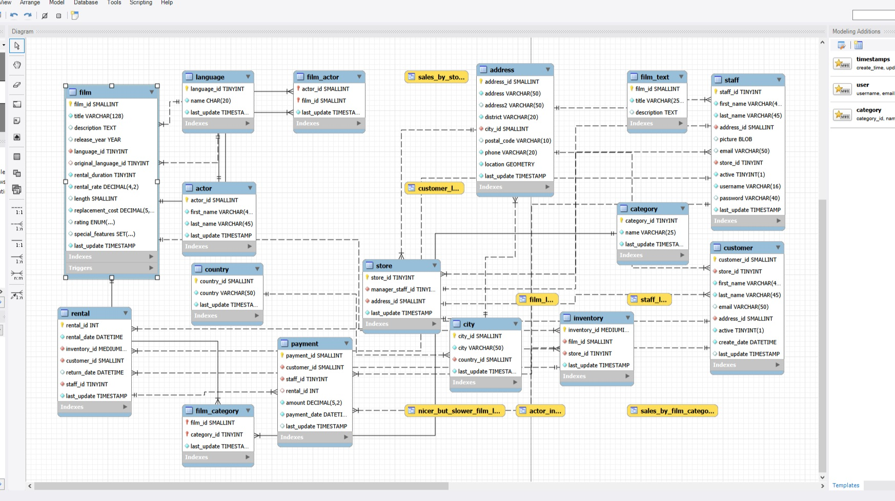

# Домашнее задание к занятию "`Работа с данными (DDL/DML)`" - `Борзенко Андрея`

### Задание 1

1.1.
`MySQL  JS > \sql`

1.2.
`MySQL  localhost:33060+ ssl  SQL > CREATE USER 'sys_temp'@'localhost';`

1.3. 

1.4. 
```
MySQL  localhost:33060+ ssl  SQL > GRANT ALL PRIVILEGES ON *.* TO 'sys_temp'@'localhost';
Query OK, 0 rows affected (0.0065 sec)
```

1.5. 

1.6.  
```
MySQL  SQL > \c sys_temp@localhost
Creating a session to 'sys_temp@localhost'
Please provide the password for 'sys_temp@localhost':
Save password for 'sys_temp@localhost'? [Y]es/[N]o/Ne[v]er (default No): Y
Fetching global names for auto-completion... Press ^C to stop.
Your MySQL connection id is 22 (X protocol)
Server version: 8.0.46 MySQL Community Server - GPL
No default schema selected; type \use <schema> to set one.
 MySQL  localhost:33060+ ssl  SQL >
```

1.7.
`$ mysqlsh -u root -p --sql localhost -f sakila-schema.sql sakila`

1.8. 

### Задание 2

```
+---------------+--------------+
| TABLE_NAME    | PRIMARY_KEY  |
+---------------+--------------+
| actor         | actor_id     |
| address       | address_id   |
| category      | category_id  |
| city          | city_id      |
| country       | country_id   |
| customer      | customer_id  |
| film          | film_id      |
| film_actor    | actor_id     |
| film_actor    | film_id      |
| film_category | film_id      |
| film_category | category_id  |
| film_text     | film_id      |
| inventory     | inventory_id |
| language      | language_id  |
| payment       | payment_id   |
| rental        | rental_id    |
| staff         | staff_id     |
| store         | store_id     |
+---------------+--------------+
```